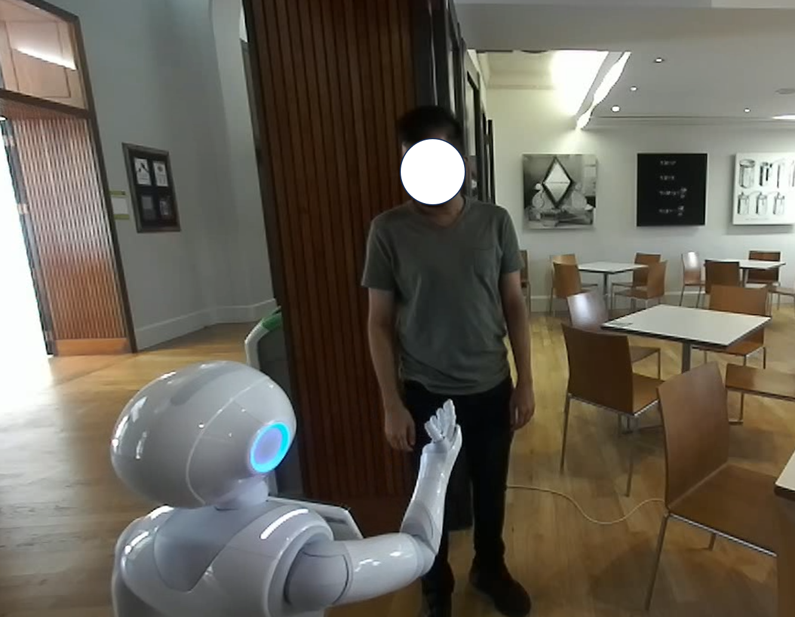
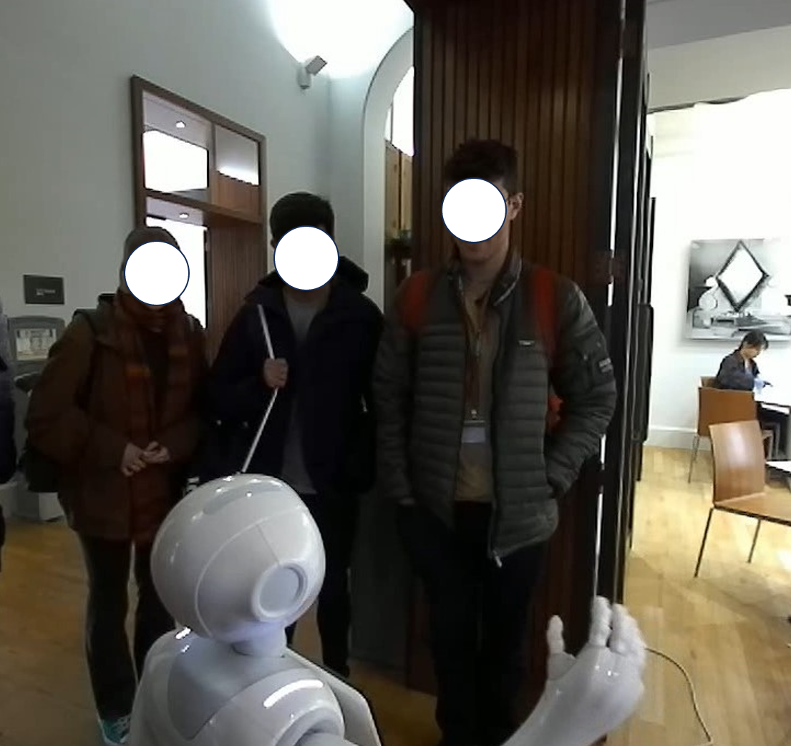
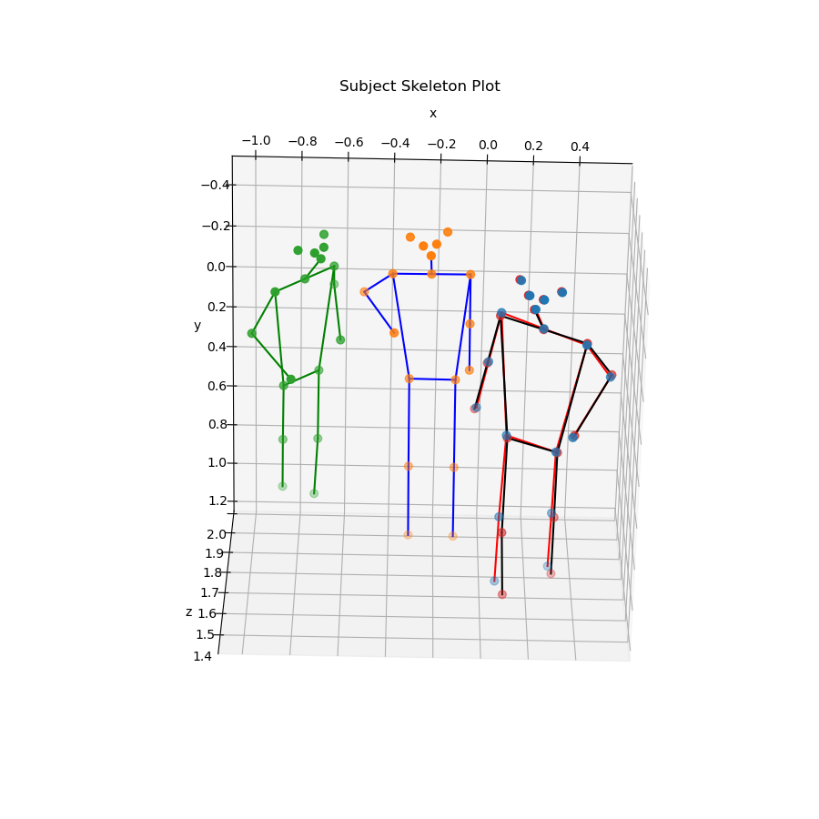
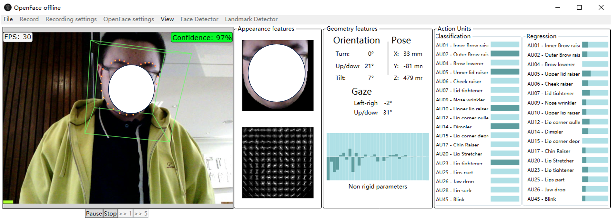
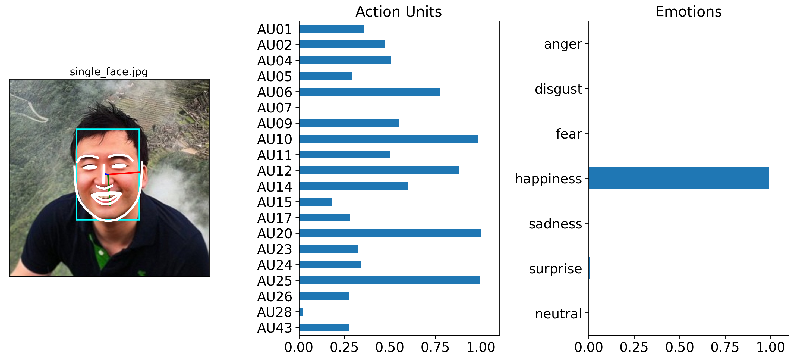
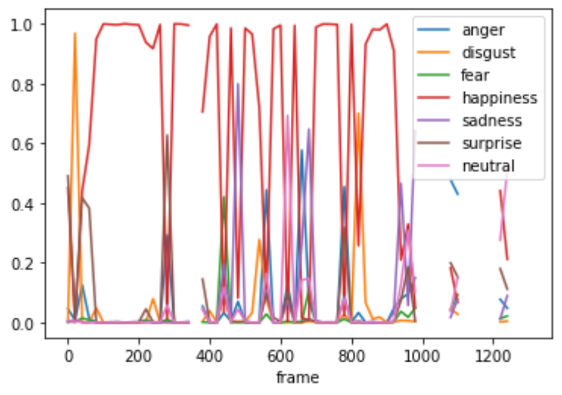
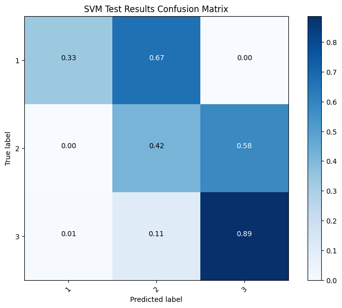
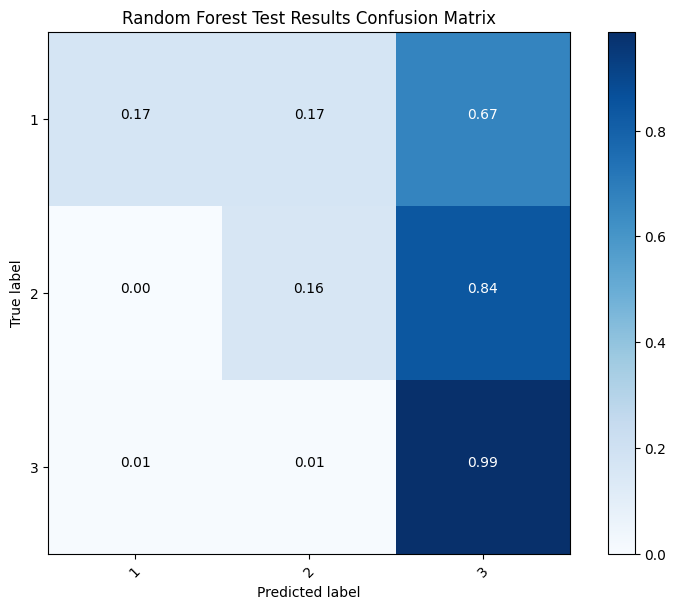
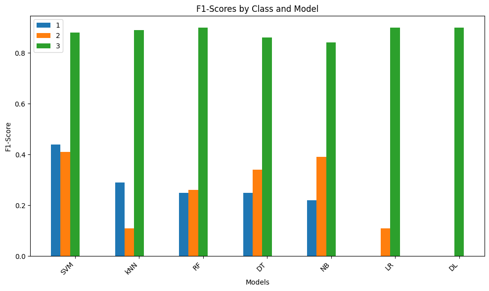

<!-- PROJECT LOGO -->
 

  

  <h3 align="center">Machine Learning for Pesonalised Robotic Service in Cafés</h3>

  

    This project is part of my dissertation for a Master's degree.
     
    <a href="https://github.com/onlyEugeneLi/Engagement_Prediction"><strong>Explore the docs »</strong></a>
     
     
    <a href="https://github.com/onlyEugeneLi/Engagement_Prediction">View Demo</a>
    ·
    <a href="https://github.com/onlyEugeneLi/Engagement_Prediction/issues">Report Bug</a>
    ·
    <a href="https://github.com/onlyEugeneLi/Engagement_Prediction/issues">Request Feature</a>
  

## About the project

### Pepper--Social Robot Applied in Human-Robot Interaction experiments

Background, brief introduction

### Experiment setting

**Third-person Perspective of the Interaction in the cafe**

**Real-time Visual Signal Received from Pepper's Perspective**

### Feature Representation

* **Body posture**

 

* **Head Pose and Eye Gaze**

 

* **Emotion Recognised from Facial Expression**

  
   
   

### Results

 

## Next steps

* Understand SVM
* Identify potential tricks to counteract imbalanced data
* Test on each them
* Visualise data based on features

## Choosing ML models

* SVM: SVMs are particularly well suited for classification of complex but small- or medium-sized datasets.
* Random Forest

## Objectives

* Train 2 / 3 models: SVM, Random Forest, Simple NN if still enough time
* Data imbalance: SMOTE, Weight
* Evaluation: Cross validation
* Visualisation
